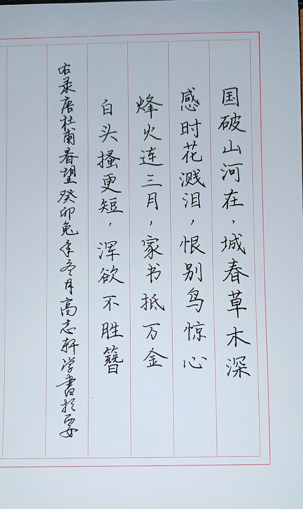

## “无役杯”立直麻将锦标赛章程

#### 赛事名称

“无役杯”立直麻将锦标赛

#### 主办单位

中水平棋牌俱乐部

#### 赛程

比赛分为预选赛与淘汰赛两个赛段，其中预选赛为期一周，淘汰赛为期两周。

预选赛：所有参赛选手需在此阶段完成四个半庄的比赛，平均顺位前八名进入淘汰赛阶段。若平均顺位相同，则精算点较高者排名靠前。

淘汰赛第一阶段（半决赛）：八名选手分为两组，每组进行四个半庄的比赛，每个组内精算点前两名晋级决赛。

淘汰赛第二阶段（决赛）：四名选手进行四个半庄的比赛，决出最终冠军。

#### 细节

- 每轮比赛都随机抽取选手分桌。

- 若预选阶段人数不可被$4$整除，则加入普通难度的电脑补齐。

- 每轮比赛开始前，由抽签阶段最先被抽出的选手创建四麻半庄战房间，并注意设置应当与下面“比赛规则”部分所述相同（正常情况下无需对设置进行额外调整）。

- 主办方仅指定每阶段持续时间，每场比赛具体时间可由同桌选手自行商议，确定时间后告知主办方即可。

- 选手迟到$8$分钟后取消比赛资格，由普通难度的电脑代替。

- 每局比赛后由当桌顺位最高的选手向主办方提供牌谱链接，并在文档中填报比赛结果。

#### 比赛规则

本赛事为立直麻将比赛项目，比赛平台为雀魂，采用雀魂规则，具体规则如下：

- 起始点数：$25000$

- 一位必要点数：$30000$，$\text{ALL LAST}$结束时一位不足则西入

- 无古役

- 有$3$张赤宝牌

- 有食断（允许断幺九副露）

- 长考时间为$5+20$秒

- 有九种九牌、四杠散了、四风连打、四家立直流局

- 有击飞

- $\text{ALL LAST}$结束庄家一位不连庄

#### 奖品设置

> 衷心感谢高老板提供的奖品

###### 顺位奖励

- 第一名：待定，比第二名的奖品要好

- 第二名：待定，比第三名的奖品要好

- 第三名：待定，比第四名的奖品要好

- 第四名：待定，比第五名～第八名的奖品要好

- 第五～第八名：示例如下
  
  

- 参与奖：待定，比第五～第八名的奖品稍差

###### 其他奖励

- 飞得更高：累计被击飞点数最多且超过$25000$，即$\left|\sum_{i=1}^{n}\min{(PT_i,0)} \right| \gt 25000$。

- 天赋异禀：起手平均向听数最少且低于$3$。

- 连胜之道：连续四个半庄获得一位或连续八个半庄获得前二。

- 振听👑：振听状态下和牌。

- 无役👑：没有手役的状态下和牌，如仅靠河底捞鱼、海底摸月、岭上开花、枪杠和牌。

- 天选之人：和出役满（不包括累计役满，但包括古役役满，如大竹林、石上三年等）。

- 朵拉战神：单次和牌时使用至少$10$张宝牌。

- 我爱截胡：和牌不超过两番，同时同桌存在其他人役满听牌（役满机会即可，包括累计役满。计自摸，不计一发、里宝牌。）

- 真闹麻了：在一个半庄中所有和牌均不超过两番并且最终取得一位。

- 点棒小偷：在一个半庄中获取的场供和罚符多于和牌点数并最终取得一位。

---

*本届比赛是否设置解说与直播视情况而定。*

*如果您对立直麻将有基本的了解且有意愿解说本届比赛，请联系我们。*

---
