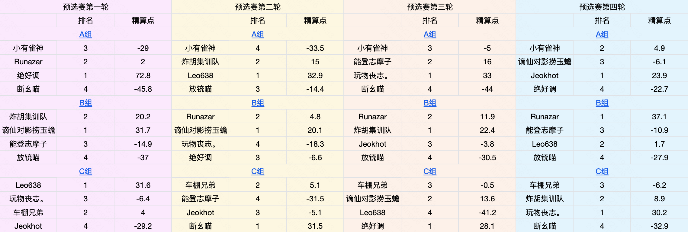
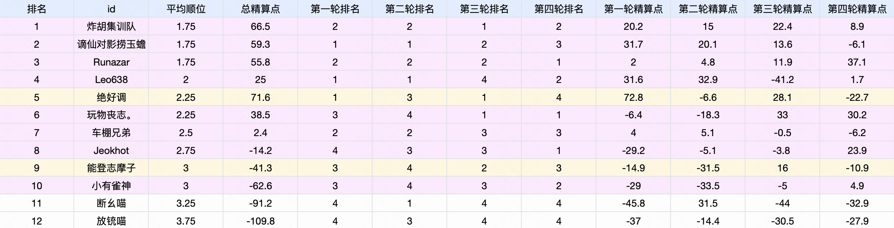
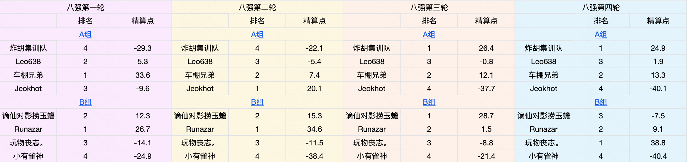
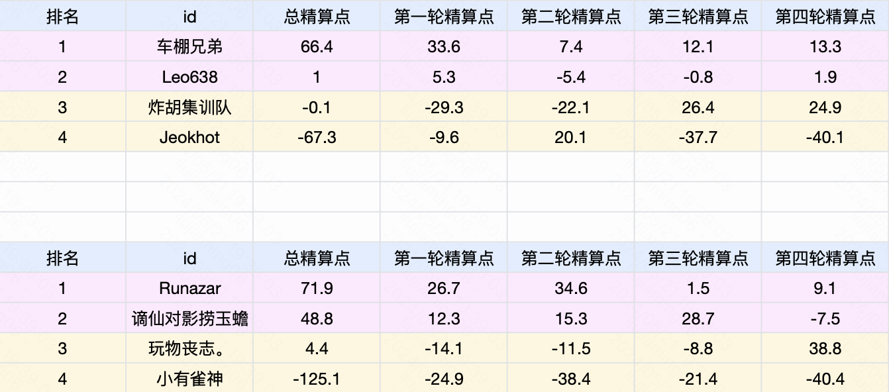
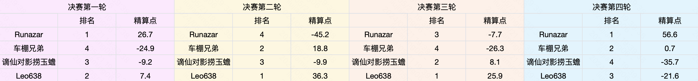
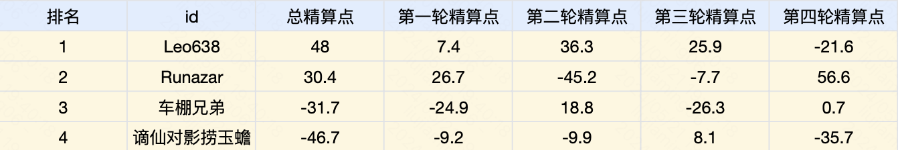

### 选手名单

##### 人类玩家

- 小有雀神

- 炸胡集训队

- Leo638

- Runazar

- 谪仙对影捞玉蟾

- 玩物丧志。

- 车棚兄弟

- 能登志摩子

- Jeokhot

##### 电脑玩家

- 断幺喵

- 绝好调

- 放铳喵

> 为将参数人数补齐为4的倍数，我们引入了雀魂中普通难度的电脑玩家，并为它们分别取了名字。

### 赛程

[“无役杯”立直麻将赛况](https://docs.qq.com/sheet/DRHh1cFhJbm1ua0pR)

  

“能登志摩子”选手退赛，“小有雀神”选手递补晋级八强。

决赛前两轮“谪仙对影捞玉蟾”选手因病缺赛，由普通电脑代替。

恭喜“Leo638”选手获得本届“无役杯”立直麻将锦标赛冠军！
